# NewShine
NewShine is small mod for Command &amp; Conquer Generals Zero Hour, this mod add new effect based on Untitled Mod and new ai from AAI with their permission. The goal is to create generals zero hour with good ai but still easy and fun.

*shellmap*

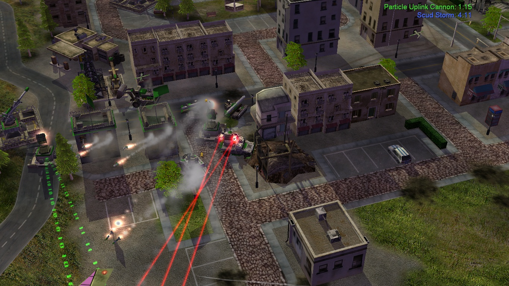

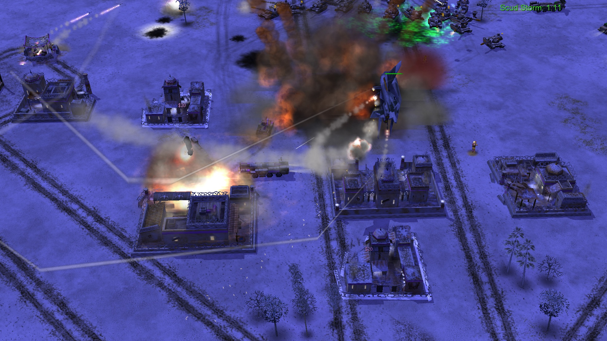
*Spectra gun exploison*

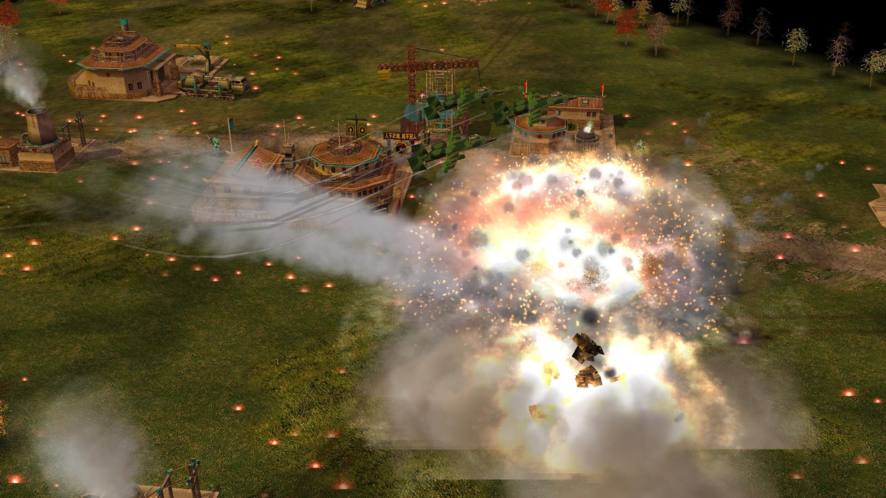
*A10 Strike*

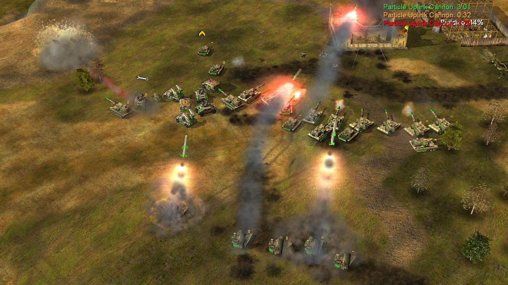

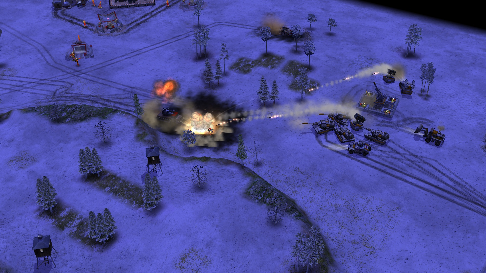
*New firebase effect*

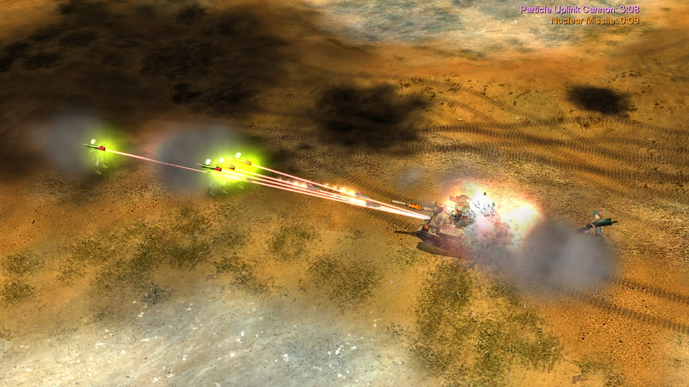
*All USA missile defender will try to use laser lock against tank spam*

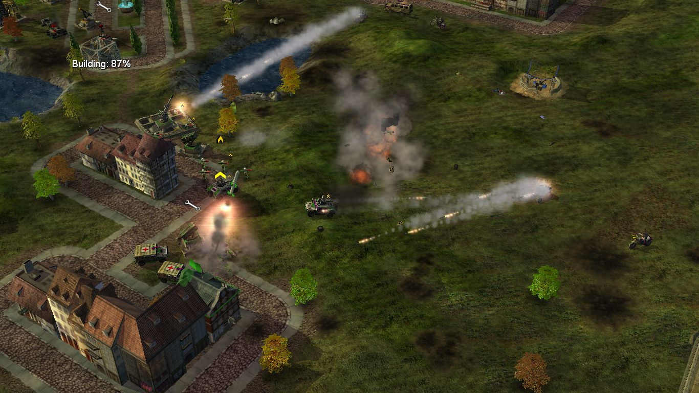
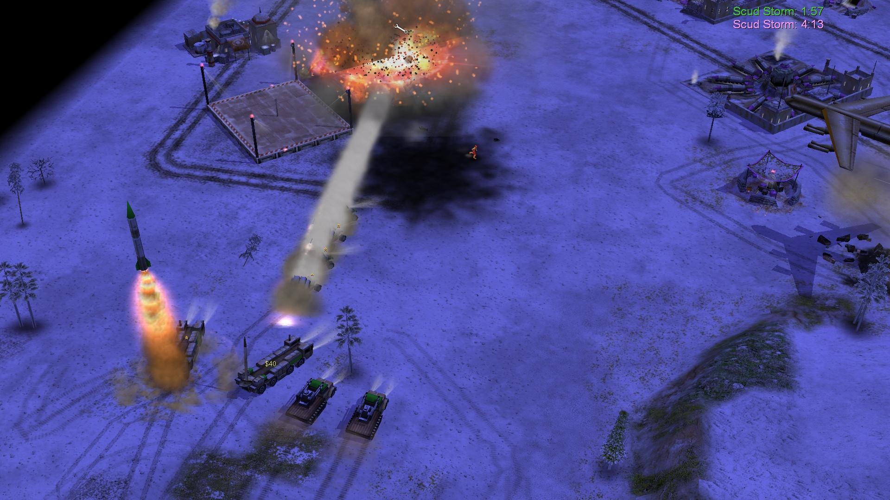
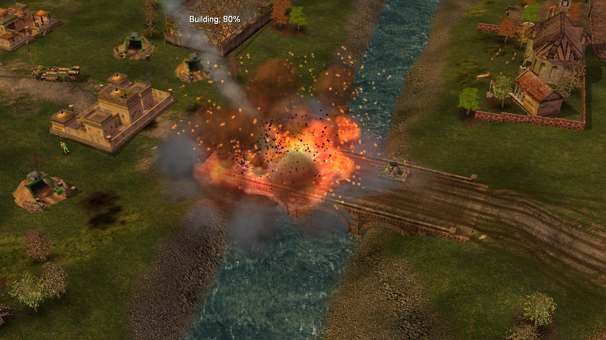
*scud launcher exploison*

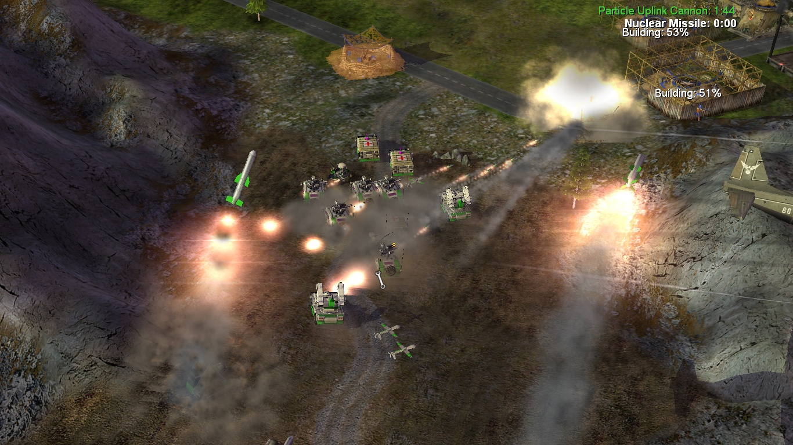
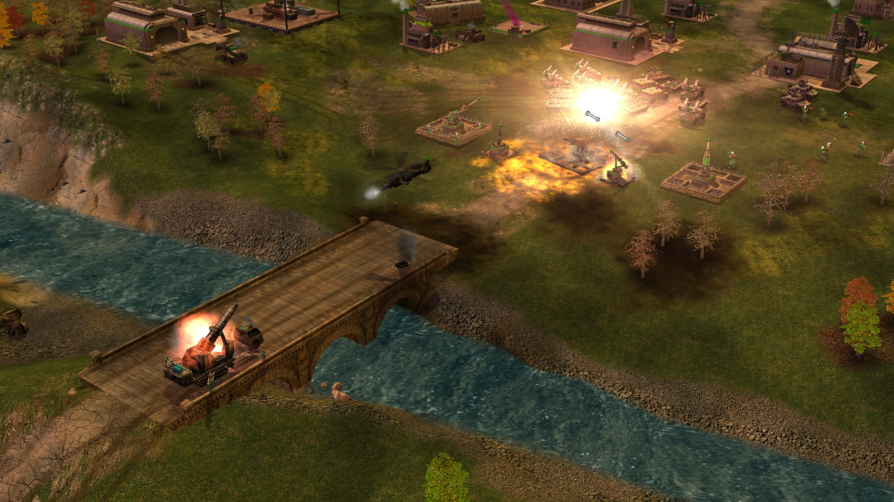
*Nuke launcher exploison*

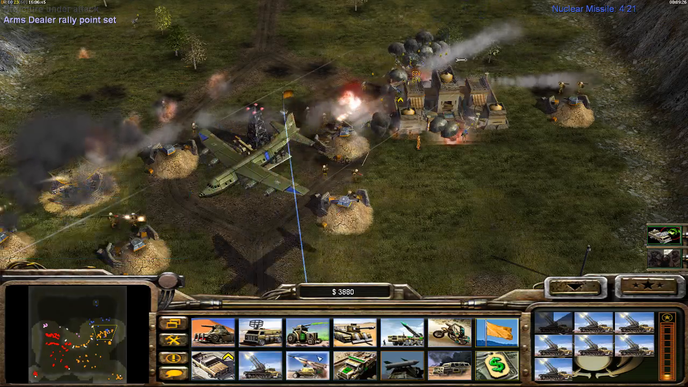
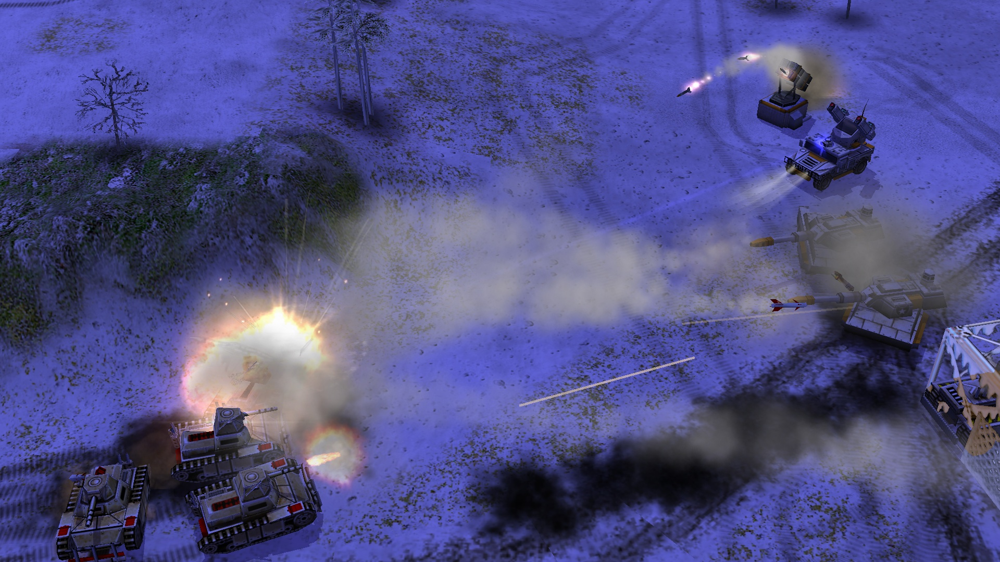

*New humvee base from C&C Untitled model*